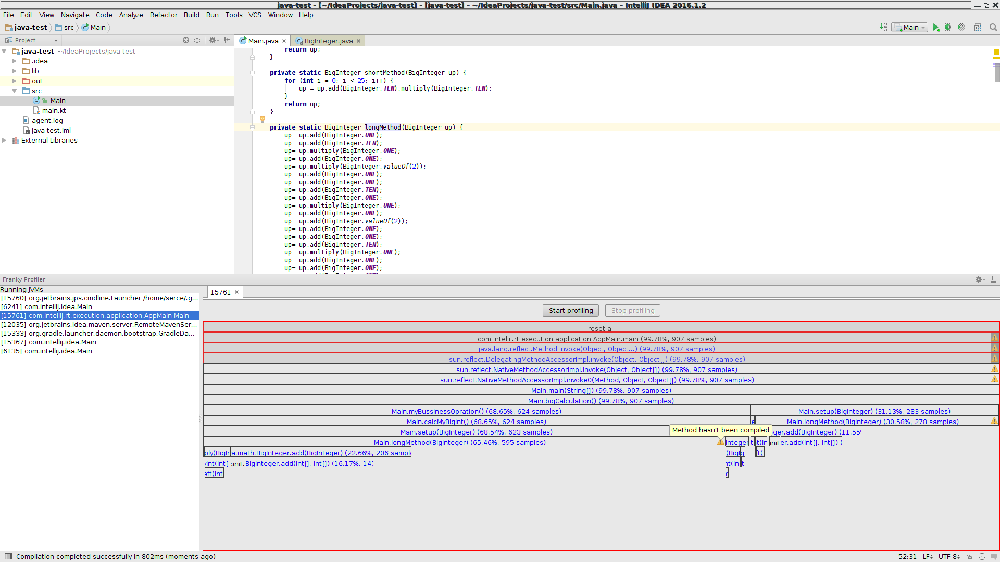

= Franky

image:https://travis-ci.org/SerCeMan/franky.svg?branch=master["Build Status", link="https://travis-ci.org/SerCeMan/franky"]

Franky - a simple profiler that always speaks frankly

== Project Goals

Goal of this project is creating a profiler which

 * Is truthful, because it is built on the top of private JVM API (AsyncGetCallTrace)
 * Can attach to any JVM on the fly
 * Easy to understand because UI is based on famous flame graphs
 * Have a rich integration with IDE with navigation and inspections showing you how to improve your code based on profiling results (actually, Franky is a plugin for IntelliJ IDEA)

== How to

 * View -> Tool Windows -> Franky Profiler
 * Choose JVM and press 'start profiling'
 * Enjoy the result!

== Get it

Franky can be installed as a plugin for IntelliJ IDEA from the link:https://plugins.jetbrains.com/plugin/8619[repository]

== Project status

Currently, the project is in the alpha stage. Native code is not highly tested and can cause a crash in some rare cases. Agent binaries available only on a restricted set of platforms.

=== Can I contribute?

Yes! I highly appreciate any contribution! Let's make the profiling great again together! 

== Build it

[source,bash]
----
./gradlew plugin
----

== Supported platforms

Linux x64

== Thanks to

* https://github.com/apangin[@apangin] for his https://github.com/apangin/async-profiler[async-profiler]
* https://github.com/RichardWarburton[@RichardWarburton] for his https://github.com/RichardWarburton/honest-profiler[honest-profiler]
* https://github.com/nitsanw[@nitsanw] for his awesome talks and the article about http://psy-lob-saw.blogspot.ru/2016/06/the-pros-and-cons-of-agct.html[AsyncGetCallTrace profiling] 
